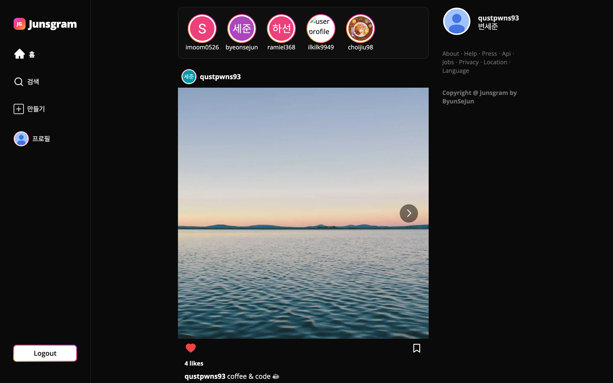

# Junsgram

[](https://github.com/byeonsejun/Junsgram/actions/workflows/ci.yml)
&nbsp;
&nbsp;
&nbsp;

> An Instagram-style photo-sharing app — and a **full modernization of a legacy Next.js 13 codebase**
> to Next.js 16 / React 19 / Auth.js v5, with a security-hardened API layer, optimistic UX,
> and unit + end-to-end test coverage running in CI.

**🔗 Live demo:** https://junsgram.vercel.app — sign in with Google, then follow `qustpwns93` to see posts in your feed.

**Features:** infinite-scroll feed · post detail · likes · comments · bookmarks · follow/unfollow · user search · multi-image upload · admin moderation.

## Screenshots



| Sign in | Profile |
| :---: | :---: |
|  |  |

---

## Why this project

It began as a tutorial-era Next.js 13 app. I treated it as a **brownfield modernization** — the kind of work real teams do far more often than greenfield — and renewed it end to end: upgraded the framework, closed security holes, introduced a typed API contract, added a test suite + CI, and shipped it to production on Vercel. Every change was made on a branch, verified (`lint · typecheck · test · build`), and merged through a green pipeline.

The result is a small app with **production-grade engineering around it.**

## Highlights

- **🔐 Security-first data layer** — parameterized every GROQ query (closing injection vectors), added server-side authorization on all mutations, and `zod` validation at every API boundary — including a `sanityId` regex that blocks injection through Sanity patch selectors (which don't support bound parameters).
- **🔄 Framework modernization** — Next.js 13.5 → **16** (App Router, Turbopack, async Request APIs, `middleware → proxy`), React 18 → **19**, and NextAuth v4 → **Auth.js v5** (split edge/Node config).
- **⚡ Optimistic UX** — likes, comments, follows, and deletes update instantly via SWR with **rollback on error**; the feed uses `useSWRInfinite` + ranged GROQ for cursor-free infinite scroll.
- **🧪 Tested & automated** — **20 Vitest unit tests** + **5 Playwright E2E tests**, both gating every PR via **GitHub Actions**. The E2E suite mints a real Auth.js session cookie to exercise authenticated flows **without hitting Google or Sanity**.
- **☁️ Real deployment know-how** — diagnosed and fixed a preview-deployment auth bug using Auth.js's **redirect-proxy** so OAuth works on dynamic Vercel preview URLs without registering each one.
- **♿ Resilient & accessible** — App Router `loading` / `error` / `global-error` boundaries, a focus-managed modal (dialog role, Escape, scroll-lock), and `aria-label`ed icon buttons.

## Tech Stack

| Area | Choices |
| --- | --- |
| Framework | Next.js 16 (App Router, Server Components, Turbopack) · React 19 |
| Language | TypeScript (`es2022`, `tsc --noEmit` in CI) |
| Auth | Auth.js v5 — Google OAuth, JWT sessions, edge-safe split config |
| Data | Sanity (content store + image CDN) · GROQ |
| Client state | SWR (optimistic mutations, `useSWRInfinite`) |
| Validation | zod |
| Styling | Tailwind CSS (dark theme) |
| Testing | Vitest (unit) · Playwright (E2E) |
| CI/CD | GitHub Actions · Vercel |

## Engineering highlights

### Security — treat all client input as hostile
- **GROQ injection:** every read query is parameterized (`$username`, `$id`, …); no string interpolation reaches the query engine.
- **Patch-selector injection:** Sanity's `patch().unset()` selectors *can't* take bound params, so IDs/keys are validated at the route boundary against a strict `sanityId` regex before they're ever interpolated.
- **Server-side authorization:** the actor is always derived from the session — never trusted from the request body. Post/comment deletion enforces author-or-admin checks (403/404), and the admin role lives in a **server-only** env var, separate from the client UI flag.
- **Input validation:** `zod` schemas validate every mutation payload (`src/lib/validation.ts`).

### Auth.js v5 migration — and a real bug it surfaced
Migrated NextAuth v4 → Auth.js v5 with a split config (`auth.config.ts` edge-safe base + `auth.ts` Sanity-backed `signIn`). Along the way I fixed a subtle data bug: the app keyed Sanity user documents on Auth.js's `user.id`, which is a **fresh random UUID per sign-in** — silently creating duplicate users on every login. Switching to the stable Google `providerAccountId` (`sub`) fixed it.

### A typed, predictable API contract
- A shared `fetcher` throws on non-2xx so SWR surfaces errors (and optimistic rollbacks fire) instead of caching error bodies.
- Standardized error responses (`src/lib/http.ts`) that **preserve the upstream status** instead of collapsing everything into an opaque 500.
- Centralized route constants and explicit service-layer return types.

### Testing strategy
- **Unit (Vitest):** validation/injection regexes, the `fetcher`'s non-2xx behavior, error-status propagation, pagination math.
- **E2E (Playwright):** unauthenticated redirect, authenticated feed render, **optimistic like**, and **infinite-scroll pagination** — run against a production build. Authentication is simulated by minting a valid Auth.js JWT cookie with `@auth/core/jwt`, and all `/api/*` calls are intercepted with fixtures, so tests are **deterministic and never touch Google or Sanity**.

### Deployment & preview environments
Vercel preview URLs change per branch, but Google OAuth requires pre-registered redirect URIs. I configured Auth.js's `AUTH_REDIRECT_PROXY_URL` so preview sign-ins proxy through the single registered production callback and return to the preview — making OAuth work on every preview deployment without per-branch setup, while relying on `trustHost` for host detection.

## Architecture

```
src/
  app/            Routes + API route handlers (App Router)
  components/     UI (+ ui/, ui/icons/)
  context/        Auth / SWR providers, cache-key context
  hooks/          SWR data hooks (posts, infinite scroll, me)
  lib/            Cross-cutting: http errors, zod validation, fetcher, pagination
  model/          Domain types
  service/        Sanity data access (parameterized GROQ)
  util/           Session helpers (server authz), date formatting
  auth.ts         Auth.js v5 — Node config (Sanity-backed signIn)
  auth.config.ts  Auth.js v5 — edge-safe base config
  proxy.ts        Route protection (Next 16 proxy convention)
tests/e2e/        Playwright specs + Auth.js cookie fixtures
```

## Getting Started

### Prerequisites
- Node.js **20+**
- A [Sanity](https://www.sanity.io/) project with an **Editor** API token (read **and** write)
- Google OAuth credentials (Google Cloud Console)

### Environment variables
```bash
cp .env.example .env.local   # then fill in real values
```

| Variable | Description |
| --- | --- |
| `GOOGLE_OAUTH_ID` / `GOOGLE_OAUTH_SECRET` | Google OAuth client credentials |
| `AUTH_SECRET` | Random secret (`openssl rand -base64 32`) |
| `NEXTAUTH_URL` | Local base URL (e.g. `http://localhost:3000`); omit on Vercel (uses `trustHost`) |
| `AUTH_REDIRECT_PROXY_URL` | *(deploys only)* routes preview OAuth through the production callback |
| `SANITY_STUDIO_SANITY_PROJECT_ID` / `SANITY_STUDIO_SANITY_DATASET` | Sanity project + dataset |
| `SANITY_SECRET_TOKEN` | Sanity **Editor** token (read **and** write) |
| `ADMIN_ID` / `NEXT_PUBLIC_ADMIN_ID` | Server-only admin username / client-side UI flag |

> The Sanity token must have **Editor** permission, or likes/comments/follow/post creation fail with a 403.

### Install & run
```bash
npm install
npm run dev          # http://localhost:3000
npm run seed         # optional: seed dummy posts (see Scripts)
```

## Scripts

| Script | Description |
| --- | --- |
| `npm run dev` | Start the dev server (Turbopack) |
| `npm run build` / `start` | Production build / serve |
| `npm run lint` / `typecheck` | ESLint (flat config) / `tsc --noEmit` |
| `npm test` / `test:watch` | Vitest unit suite |
| `npm run test:e2e` | Playwright E2E (builds + serves the app) |
| `npm run seed` | Seed dummy posts into Sanity (`-- --count=N`, `--user=<name>`, `--clean`) |

## Roadmap

Next up: modal focus-trap sweep, a tag-based Sanity caching strategy (carefully validating token-authenticated CDN reads), and a dependency refresh.
